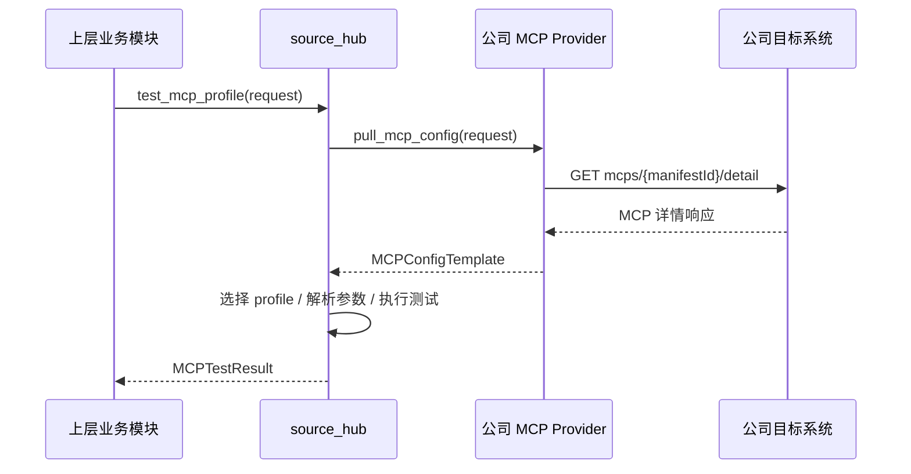
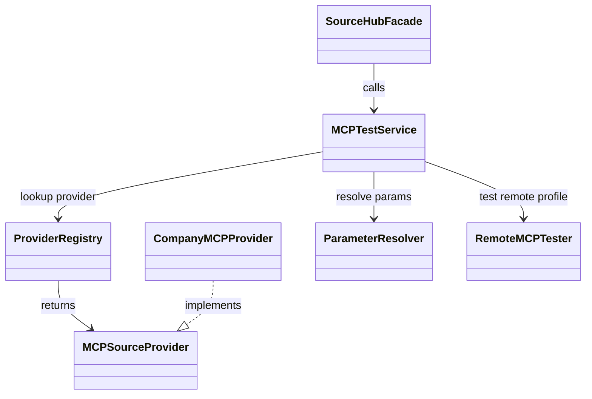
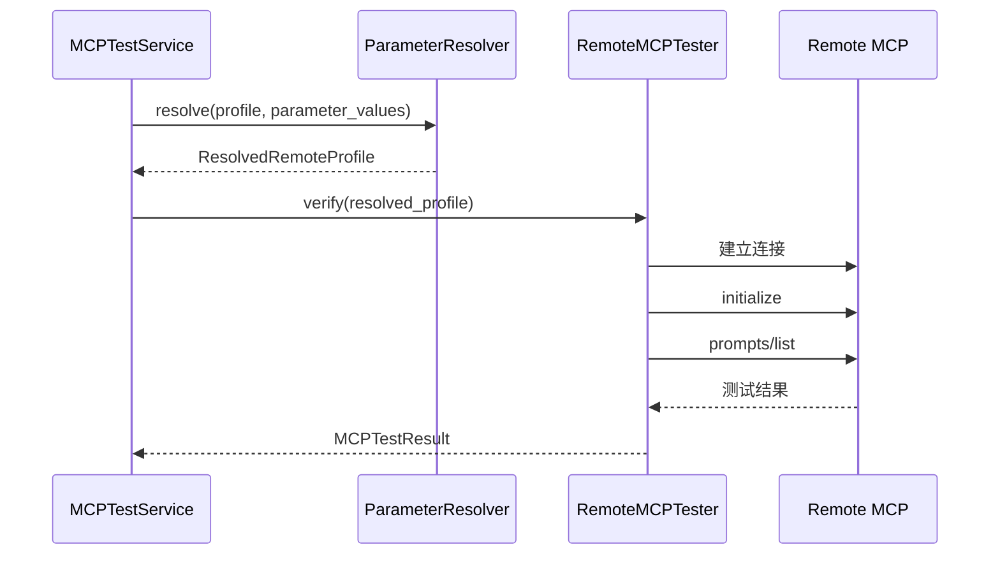

# source_hub MCP测试能力设计

## 1. 概述

本文档聚焦 `source_hub` 中 `MCP` 测试能力的设计。`source_hub` 的整体背景、模块分层、Provider 抽象、代码目录结构以及 `MCP profile` 抽取规则，已在 [source_hub模块设计](./source_hub模块设计.md) 中说明，本文不再重复展开。

当前测试能力直接依赖以下现有信息：

- `source_hub` 总体设计与代码组织：[source_hub模块设计](./source_hub模块设计.md)
- 公司目标系统上游接口定义：[MCP 接口文档](./目标系统接口/MCP.md)

### 1.1 目标

- 基于 `MCPProfile` 执行统一测试。
- 输出基本连通性测试结果。
- 输出是否支持 `prompts/list` 的显式判定结果。
- 为后续客户端自动生成配置提供稳定输入。

### 1.2 职责边界

本能力负责：

- 选择指定 `MCP profile` 作为测试目标。
- 解析测试所需参数并生成最终运行配置。
- 执行基本连通性测试与 `prompts/list` 探测。
- 输出统一 `MCPTestResult`。

本能力不负责：

- 保存测试结果到群组配置。
- 根据测试结果直接生成最终客户端配置。
- 在当前版本执行本地 `npx` / `uvx` / `docker` / `cmd` 命令拉起 `MCP`。

## 2. 整体设计

### 2.1 能力定位

`MCP` 测试能力位于 `pull_mcp_config` 之后、客户端配置生成之前。它消费 `source_hub` 已统一抽取的 `profiles`，输出结构化测试结果，供上层业务决定后续配置生成策略。

### 2.2 测试对象

测试对象统一为 `MCPProfile`。关于 `MCPProfile` 的来源和 `remote`、`local`、`bootstrap_remote` 三类模式的划分，见 [source_hub模块设计](./source_hub模块设计.md) 第 `5.2` 章。

测试能力不直接处理公司目标系统返回的原始 DTO，而是只消费统一后的：

- `profiles`
- `parameter_definitions`
- `metadata`

### 2.3 测试目标

当前测试结果需要覆盖两个核心判定：

- `connectivity_ok`
  是否完成目标 `MCP` 的基本连通性和 `initialize`
- `supports_prompt_list`
  是否明确支持 `prompts/list`

其中 `supports_prompt_list` 需要作为一级结果字段返回，不能只放在 `diagnostics` 中。上层业务后续自动生成客户端配置时，应直接依赖该字段判断是否启用 prompt 相关配置。

### 2.4 当前版本范围

当前版本先落地：

- `mode=remote` 的远端 `MCP` 测试

以下模式先保留设计口子，不在本版本执行：

- `mode=local`
- `mode=bootstrap_remote`

原因在于这两类模式会引入本地命令执行、进程生命周期管理、执行环境隔离与资源清理等额外复杂度，建议单独实现为后续任务。

### 2.5 总体流程



## 3. 代码组织与文件结构设计

`source_hub` 的整体目录结构见 [source_hub模块设计](./source_hub模块设计.md) 第 `3.1` 章。`MCP` 测试能力建议单独收敛在 `mcp/testing/` 包中，具体结构如下：

```text
src/scaffolding_backend/source_hub/mcp/testing/
├── __init__.py                 # 测试能力包入口
├── contracts.py                # TestMCPProfileRequest、MCPTestResult 等契约
├── service.py                  # MCPTestService
├── parameter_resolver.py       # 参数替换与模板解析
└── executors/
    ├── __init__.py             # 测试执行器包
    ├── base.py                 # 测试执行器抽象
    ├── remote.py               # mode=remote 的测试执行器
    ├── local.py                # mode=local 的预留执行器
    └── bootstrap_remote.py     # mode=bootstrap_remote 的预留执行器
```

### 3.1 依赖关系



### 3.2 分层职责

- `MCPTestService`
  负责整体编排，包括拉取配置、选择 profile、参数解析、调度执行器、汇总结果。
- `ParameterResolver`
  负责参数合并、占位符替换、敏感信息脱敏。
- `RemoteMCPTester`
  负责 `mode=remote` 的具体连接、初始化和 `prompts/list` 探测。

## 4. MCP 测试能力设计

### 4.1 对外接口

当前版本对外提供：

```python
class SourceHubFacade:
    async def test_mcp_profile(self, request: TestMCPProfileRequest) -> MCPTestResult:
        ...
```

请求模型建议如下：

```python
class TestMCPProfileRequest:
    source_code: str
    manifest_id: str
    publisher_id: str
    version: str | None
    profile_name: str | None
    parameter_values: dict[str, str]
```

其中：

- `profile_name` 用于在同一 `MCP` 的多个 profile 中定位具体测试目标
- `parameter_values` 用于补充模板参数，如 URL、headers、认证令牌等

### 4.2 通用编排流程

`testing/service.py` 的通用流程如下：

1. 调用 `pull_mcp_config`
2. 从 `MCPConfigTemplate.profiles` 中选择目标 profile
3. 调用 `ParameterResolver` 解析参数
4. 校验 profile 模式与当前执行器是否匹配
5. 调用对应执行器完成测试
6. 汇总测试结果并返回 `MCPTestResult`

当前版本仅第 `5` 步实际落地 `RemoteMCPTester`。

### 4.3 参数解析

`parameter_resolver.py` 负责处理如下逻辑：

- 合并 profile 默认值与调用方传入值
- 校验必填参数是否齐全
- 对 `url_template`、`headers_template` 中的 `{{PARAM}}` 占位符进行替换
- 对敏感参数执行日志脱敏

参数解析产物建议包含：

- `resolved_url`
- `resolved_headers`
- `timeout`
- `masked_parameter_values`

### 4.4 远端 MCP 测试

#### 4.4.1 适用范围

远端测试仅适用于：

- `profile.mode == "remote"`
- `transport` 为 `sse` 或 `streamable-http`

#### 4.4.2 执行流程



#### 4.4.3 测试阶段

远端 `MCP` 测试分为四层：

1. 输入校验  
   校验 profile 是否存在、模式是否为 `remote`、URL 和 transport 是否合法。

2. 地址可达性校验  
   校验目标地址是否可连接，超时是否合理。

3. MCP 协议初始化  
   与远端服务建立 MCP 会话，完成 `initialize`。

4. `prompts/list` 探测  
   在初始化成功后执行 `prompts/list`，判断当前服务是否支持 prompt 列表能力。

#### 4.4.4 结果判定

建议按以下口径输出结果：

- `initialize` 失败  
  `connectivity_ok=False`  
  `supports_prompt_list=None`  
  `overall_status=FAIL`

- `initialize` 成功，`prompts/list` 成功  
  `connectivity_ok=True`  
  `supports_prompt_list=True`  
  `overall_status=PASS`

- `initialize` 成功，`prompts/list` 明确不支持  
  `connectivity_ok=True`  
  `supports_prompt_list=False`  
  `overall_status=PARTIAL_PASS`

- `initialize` 成功，但 `prompts/list` 探测异常  
  `connectivity_ok=True`  
  `supports_prompt_list=None`  
  `prompt_list_status=ERROR`  
  `overall_status=PARTIAL_PASS`

其中“明确不支持”通常表现为服务端返回 `method not found`、`prompts/list not supported` 或等价协议错误。

### 4.5 结果模型

```python
class MCPTestResult:
    overall_status: str
    profile_name: str | None
    mode: str
    connectivity_ok: bool
    supports_prompt_list: bool | None
    prompt_list_status: str
    resolved_url: str | None
    latency_ms: int | None
    message: str
    diagnostics: dict[str, Any]
```

建议字段语义如下：

- `overall_status`
  取值建议为 `PASS`、`PARTIAL_PASS`、`FAIL`、`UNSUPPORTED`
- `supports_prompt_list`
  `True` 表示明确支持，`False` 表示明确不支持，`None` 表示本次未探测出确定结果
- `prompt_list_status`
  取值建议为 `SUPPORTED`、`NOT_SUPPORTED`、`NOT_TESTED`、`ERROR`、`UNSUPPORTED`

旧版纯工具 `MCP` 的典型结果应为：

- `connectivity_ok=True`
- `supports_prompt_list=False`
- `overall_status=PARTIAL_PASS`

### 4.6 Unsupported 场景

以下场景建议直接返回 `UNSUPPORTED`：

- profile 不存在
- profile 的 `mode` 不为 `remote`
- profile 的 `transport` 不属于 `sse`、`streamable-http`

### 4.7 错误处理

建议统一错误分类：

- `UnsupportedTestTargetError`
- `TestParameterMissingError`
- `TestParameterResolveError`
- `TestConnectTimeoutError`
- `TestConnectFailedError`
- `TestProtocolInitError`
- `TestPromptListError`

## 5. 预留扩展

### 5.1 本地 MCP 测试

`mode=local` 的测试需要额外解决：

- 本地命令执行权限
- 进程生命周期管理
- `stdio` 会话管理
- 超时与清理策略

建议单独拆分为后续任务，不在当前版本实现。

### 5.2 Bootstrap Remote MCP 测试

`mode=bootstrap_remote` 的测试需要额外解决：

- 预启动命令执行
- 本地 HTTP/SSE 服务就绪探测
- 进程退出与资源清理

建议单独拆分为后续任务，不在当前版本实现。

### 5.3 后续演进方向

后续可在当前设计基础上继续扩展：

- 为 `test_mcp_profile` 增加 `local` 与 `bootstrap_remote` 的执行器路由
- 增加本地命令执行隔离 runner
- 增加测试结果落库与审计能力
- 增加 `prompts/get`、`resources/list` 等扩展探测能力
