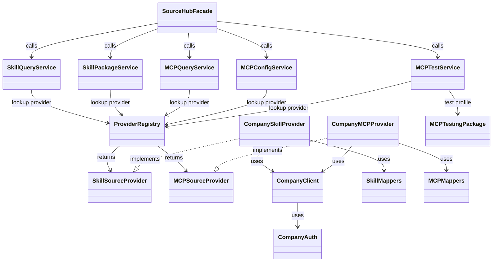
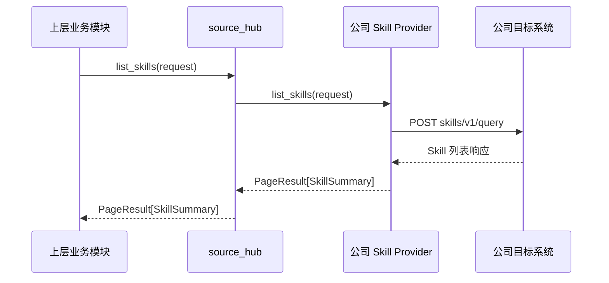
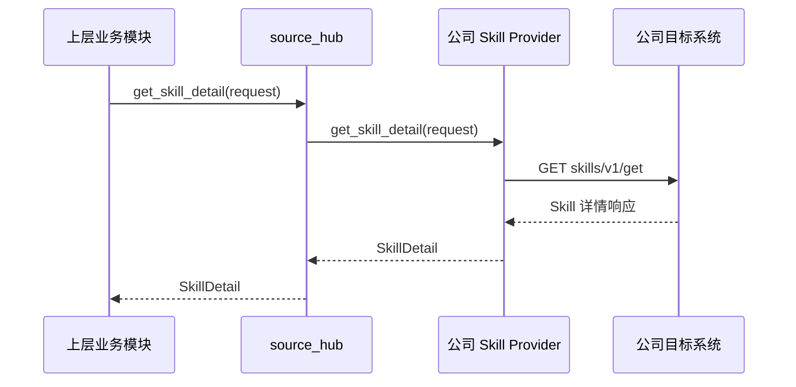
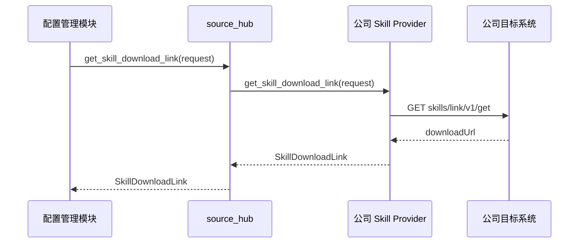
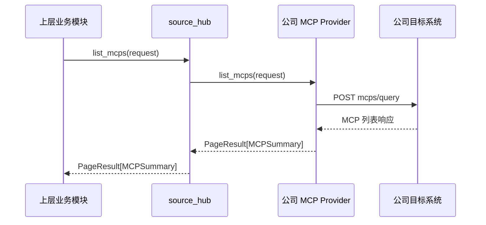
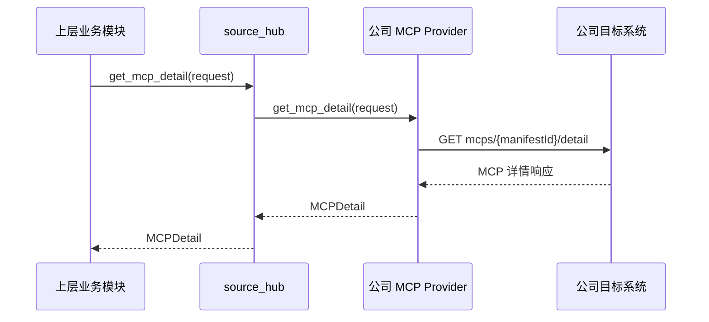
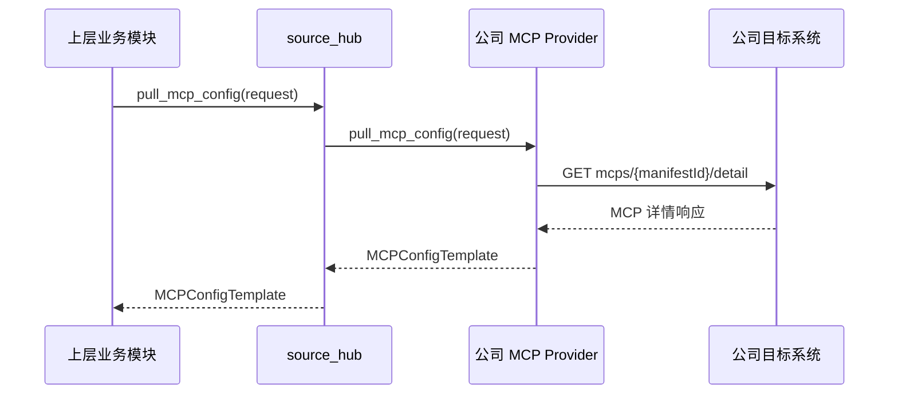

# source_hub 模块设计

## 1. 概述

`source_hub` 是脚手架后端服务中的独立子模块，负责对接公司目标系统以及后续可能接入的其他来源系统，向上层业务提供统一的 `skill` 和 `mcp` 能力。

从能力边界上，`source_hub` 内部分为两条主链路：

- `skill`：查询、详情、包下载
- `mcp`：查询、详情、配置拉取、测试能力

### 1.1 目标

- 提供统一的 `skill` 查询和包下载能力。
- 提供统一的 `mcp` 查询、配置拉取和测试能力。
- 屏蔽不同来源系统的接口差异，输出统一模型。
- 为后续接入业界来源和其他内部来源保留扩展点。

### 1.2 职责边界

本模块负责：

- 查询 `skill`、`mcp` 列表与详情。
- 下载指定版本 `skill` 包。
- 拉取统一后的 `mcp` 配置。
- 对候选 `MCP` 执行测试。

本模块不负责：

- 群组配置的保存、修改、加载、下发和生效。
- 用户、群组、权限管理。
- `skill` 的本地解压、安装和执行。
- 本地 `stdio`/`npx`/`uvx`/`docker` 型 `MCP` 的安装和启动。

本模块输出的是候选源数据、`skill` 包下载能力、统一后的 `mcp` 配置以及测试结果，不负责最终配置持久化和客户端运行态管理。

## 2. 整体设计

`source_hub` 位于上层业务模块与外部来源系统之间，承担统一接入层职责：对上提供按资源类型划分的能力接口，对下通过可插拔的 Provider 对接不同来源系统。

### 2.1 架构分层

```text
上层业务模块
    |
    v
SourceHubFacade
    |
    +-- SkillQueryService
    +-- SkillPackageService
    +-- MCPQueryService
    +-- MCPConfigService
    +-- MCPTestService
            |
            +-- MCP Testing Package
    |
    +-- ProviderRegistry
            |
            +-- CompanySkillProvider
            +-- CompanyMCPProvider
            +-- Future Providers...
```

整体上分为四层：

- 门面层：对上暴露统一入口。
- 资源服务层：按 `skill`、`mcp` 拆分能力编排。
- Provider 层：封装不同来源系统的接口调用和字段映射。
- 测试层：封装与来源无关的 `MCP` 测试逻辑。

### 2.2 多来源扩展

为避免当前实现与公司目标系统深度耦合，模块采用“上层按资源拆分，下层按来源适配”的结构。扩展原则如下：

- `skill` 和 `mcp` 在服务层分开设计，互不混用流程。
- 每个来源系统使用独立 Provider 实现，不共享来源侧 DTO。
- 服务层只依赖统一抽象，不依赖具体来源实现。
- 测试层只消费统一后的 `MCP profile` 模型，不直接读取来源原始响应。

建议保留两类 Provider 抽象：

```python
class SkillSourceProvider(Protocol):
    source_code: str

    async def list_skills(self, request: ListSkillsRequest) -> PageResult[SkillSummary]:
        ...

    async def get_skill_detail(self, request: GetSkillDetailRequest) -> SkillDetail:
        ...

    async def get_skill_download_link(self, request: GetSkillDownloadLinkRequest) -> SkillDownloadLink:
        ...


class MCPSourceProvider(Protocol):
    source_code: str

    async def list_mcps(self, request: ListMCPsRequest) -> PageResult[MCPSummary]:
        ...

    async def get_mcp_detail(self, request: GetMCPDetailRequest) -> MCPDetail:
        ...

    async def pull_mcp_config(self, request: PullMCPConfigRequest) -> MCPConfigTemplate:
        ...
```

### 2.3 与群组配置和客户端配置的关系

结合现有后端原始设计，群组配置和用户配置最终都落在 `config: json` 中。`source_hub` 不直接保存这份配置，但需要为配置管理模块提供可持久化的候选结构。

建议按三层对象理解：

- 候选项
  `source_hub` 返回给管理员选择的 `SkillSummary`、`SkillDetail`、`MCPSummary`、`MCPDetail`、`MCPProfile`
- 群组持久化配置
  配置管理模块根据管理员选择结果，将 `skill`、`mcp` 配置项写入群组 `config`
- 客户端运行配置
  配置加载流程基于群组 `config` 生成客户端最终可消费的 `skill` 引用和 `mcpServers` 运行配置

建议群组 `config` 顶层结构如下：

```json
{
  "schemaVersion": 1,
  "skills": [],
  "mcps": []
}
```

其中：

- `skills` 保存选中的 `skill` 引用
- `mcps` 保存选中的 `mcp` 来源、profile 和参数值
- 客户端最终运行配置不直接等于群组持久化配置，而是在配置加载阶段生成

## 3. 代码组织与文件结构设计

### 3.1 目录结构

代码目录从 `src/scaffolding_backend/source_hub/` 开始组织：

```text
src/scaffolding_backend/source_hub/
├── __init__.py                         # 模块包入口
├── facade.py                           # 模块统一对外入口
├── registry.py                         # Provider 注册、查找与路由
├── common/
│   ├── __init__.py                     # 公共能力包
│   ├── exceptions.py                   # 模块级异常定义
│   └── page.py                         # 分页等公共模型
├── skill/
│   ├── __init__.py                     # skill 资源能力包
│   ├── contracts.py                    # skill 对外契约
│   ├── models.py                       # skill 统一模型
│   ├── query_service.py                # skill 查询能力编排
│   └── package_service.py              # skill 包下载能力编排
├── mcp/
│   ├── __init__.py                     # mcp 资源能力包
│   ├── contracts.py                    # mcp 查询与配置拉取对外契约
│   ├── models.py                       # mcp 与 profile 统一模型
│   ├── query_service.py                # mcp 查询能力编排
│   ├── config_service.py               # mcp 配置拉取能力编排
│   └── testing/                        # mcp 测试能力包，具体结构见独立测试设计文档
└── providers/
    ├── __init__.py                     # 来源 Provider 包
    ├── base.py                         # Provider 抽象接口定义
    └── company/
        ├── __init__.py                 # 公司目标系统来源实现
        ├── auth.py                     # 公司目标系统鉴权封装
        ├── client.py                   # 公司目标系统 HTTP 调用封装
        ├── skill_schemas.py            # 公司来源 skill DTO 定义
        ├── skill_mappers.py            # 公司 skill DTO 到统一模型的映射
        ├── skill_provider.py           # 公司来源 skill provider 实现
        ├── mcp_schemas.py              # 公司来源 mcp DTO 定义
        ├── mcp_mappers.py              # 公司 mcp DTO 到统一模型的映射
        └── mcp_provider.py             # 公司来源 mcp provider 实现
```

### 3.2 依赖关系

主要对象依赖关系如下：



### 3.3 模块对外接口

`source_hub` 对上层统一提供以下接口能力：

```python
class SourceHubFacade:
    async def list_skills(self, request: ListSkillsRequest) -> PageResult[SkillSummary]:
        ...

    async def get_skill_detail(self, request: GetSkillDetailRequest) -> SkillDetail:
        ...

    async def get_skill_download_link(self, request: GetSkillDownloadLinkRequest) -> SkillDownloadLink:
        ...

    async def list_mcps(self, request: ListMCPsRequest) -> PageResult[MCPSummary]:
        ...

    async def get_mcp_detail(self, request: GetMCPDetailRequest) -> MCPDetail:
        ...

    async def pull_mcp_config(self, request: PullMCPConfigRequest) -> MCPConfigTemplate:
        ...

    async def test_mcp_profile(self, request: TestMCPProfileRequest) -> MCPTestResult:
        ...
```

无论最终通过 HTTP、RPC 还是内部服务方式暴露，模块内部都应以 `SourceHubFacade` 作为统一入口，不直接对外暴露 Provider。

## 4. Skill 能力设计

当前版本 `skill` 侧依赖的公司目标系统接口文档为 [Skill 接口文档](./目标系统接口/Skill.md)。

### 4.1 Skill 查询能力

#### 4.1.1 查询边界

`skill` 查询链路保持轻量，只承担管理端或展示端所需的元数据查询能力：

- 列表阶段返回 `SkillSummary`
- 详情阶段返回 `SkillDetail`
- 不在查询阶段触发下载

#### 4.1.2 `list_skills`

依赖上游接口：`skills/v1/query`



关键字段引用范围：

| 类型 | 字段 |
| --- | --- |
| 请求 | `keyword`、`pageNum`、`pageSize`、`publishLevel` |
| 响应 | `skillId`、`name`、`latestDescription`、`latestVersion`、`tags`、`publisher` |

输出模型 `SkillSummary` 建议包含：

- `source_code`
- `skill_id`
- `name`
- `description`
- `version`
- `tags`
- `publisher`

关键字段映射：

| 输出字段 | 上游字段 |
| --- | --- |
| `skill_id` | `skillId` |
| `name` | `name` |
| `description` | `latestDescription` |
| `version` | `latestVersion` |
| `tags` | `tags[].name` |
| `publisher` | `publisher` |

#### 4.1.3 `get_skill_detail`

依赖上游接口：`skills/v1/get`



关键字段引用范围：

| 类型 | 字段 |
| --- | --- |
| 请求 | `skillId`、`version` |
| 响应 | `skillId`、`name`、`version`、`content`、`description`、`archiveUrl` |

输出模型 `SkillDetail` 在 `SkillSummary` 基础上增加：

- `content`
- `archive_url`

关键字段映射：

| 输出字段 | 上游字段 |
| --- | --- |
| `skill_id` | `skillId` |
| `name` | `name` |
| `description` | `description` |
| `version` | `version` |
| `content` | `content` |
| `archive_url` | `archiveUrl` |

### 4.2 Skill 包临时下载链接能力

#### 4.2.1 下载边界

`get_skill_download_link` 用于补齐 `skill` 的最终使用闭环。配置管理模块在配置加载流程中调用该能力，为客户端按需获取指定版本 `skill` 包的临时下载地址。`source_hub` 不直接代理包内容，而是返回来源侧生成的临时下载链接。

#### 4.2.2 `get_skill_download_link`

依赖上游接口：`skills/link/v1/get`



关键字段引用范围：

| 类型 | 字段 |
| --- | --- |
| 请求 | `skillId`、`version` |
| 响应 | `data.downloadUrl` |

#### 4.2.3 请求与返回

建议请求至少包含：

- `source_code`
- `skill_id`
- `version`

建议返回结果如下：

```python
class SkillDownloadLink:
    download_url: str
```

其中 `download_url` 直接对应上游接口返回的 `data.downloadUrl`。

#### 4.2.4 作用说明

- 配置管理模块在配置加载流程中按需调用该能力。
- `source_hub` 当前版本直接代理上游 `skills/link/v1/get`。
- 返回结果为临时下载链接，供客户端后续下载完整 `skill` 包。
- 临时下载链接不进入群组持久化配置，仅在加载或同步流程中按需获取。

#### 4.2.5 群组配置项建议

对于 `skill`，建议群组 `config.skills` 中只保存来源引用，不保存详情内容和下载地址。

建议的持久化结构如下：

```python
class SkillConfigEntry:
    id: str
    enabled: bool
    source_ref: SkillSourceRef


class SkillSourceRef:
    source_code: str
    skill_id: str
    version: str
```

示例：

```json
{
  "id": "skill:company:excel-skill@1.0.3",
  "enabled": true,
  "sourceRef": {
    "sourceCode": "company",
    "skillId": "excel-skill",
    "version": "1.0.3"
  }
}
```

配置加载阶段，客户端基于 `sourceRef` 判断本地是否已有对应版本；若不存在，则由配置管理模块调用 `get_skill_download_link` 获取临时下载地址，客户端再下载完整 `skill` 包。

#### 4.2.6 错误处理

建议统一错误分类：

- `SourceNotSupportedError`
- `SourceAuthError`
- `SourceRequestError`
- `SourceResourceNotFoundError`
- `SkillPackageDownloadError`

## 5. MCP 能力设计

当前版本 `mcp` 侧依赖的公司目标系统接口文档为 [MCP 接口文档](./目标系统接口/MCP.md)。

### 5.1 MCP 查询能力

#### 5.1.1 查询边界

`mcp` 查询链路用于管理端候选项展示：

- 列表阶段返回 `MCPSummary`
- 详情阶段返回 `MCPDetail`
- 查询结果保留后续配置拉取和测试所需的定位信息

#### 5.1.2 `list_mcps`

依赖上游接口：`mcps/query`



关键字段引用范围：

| 类型 | 字段 |
| --- | --- |
| 请求 | `pageNum`、`pageSize`、`keyWord`、`categoryIdList`、`tagIdList`、`mcpMode` |
| 响应 | `manifestId`、`publisherId`、`name`、`description`、`version`、`tagList`、`categoryList`、`isLocal` |

输出模型 `MCPSummary` 建议包含：

- `source_code`
- `manifest_id`
- `publisher_id`
- `name`
- `description`
- `version`
- `tags`
- `categories`
- `is_local`

关键字段映射：

| 输出字段 | 上游字段 |
| --- | --- |
| `manifest_id` | `manifestId` |
| `publisher_id` | `publisherId` |
| `name` | `name` |
| `description` | `description` |
| `version` | `version` |
| `tags` | `tagList[].name` |
| `categories` | `categoryList[].name` |
| `is_local` | `isLocal` |

#### 5.1.3 `get_mcp_detail`

依赖上游接口：`mcps/{manifestId}/detail`



关键字段引用范围：

| 类型 | 字段 |
| --- | --- |
| 请求 | `manifestId`、`publisherId`、`version` |
| 响应 | `manifestId`、`publisherId`、`name`、`description`、`version`、`config.remoteList`、`config.remote`、`config.npx`、`config.uvx`、`config.docker`、`config.parameters` |

输出模型 `MCPDetail` 在 `MCPSummary` 基础上增加：

- `content`
- `demands`
- `profiles`

关键字段映射：

| 输出字段 | 上游字段 |
| --- | --- |
| `manifest_id` | `manifestId` |
| `publisher_id` | `publisherId` |
| `name` | `name` |
| `description` | `description` |
| `version` | `version` |
| `profiles` | `config.remoteList` / `config.remote` / `config.npx` / `config.uvx` / `config.docker` |

### 5.2 MCP 配置拉取能力

#### 5.2.1 能力定位

`pull_mcp_config` 用于从来源侧详情中抽取并生成统一后的运行配置模板，供上层业务保存或进一步加工。这里的重点不是只返回远端端点，而是返回客户端可消费的 `MCP` 配置 profile 列表。

#### 5.2.2 `pull_mcp_config`

依赖上游接口：`mcps/{manifestId}/detail`



关键字段引用范围：

| 类型 | 字段 |
| --- | --- |
| 请求 | `manifestId`、`publisherId`、`version` |
| 响应 | `config.parameters`、`config.remoteList`、`config.remote`、`config.npx`、`config.uvx`、`config.docker`、`config.packageDownloadUrl`、`config.expireIn` |

#### 5.2.3 输出模型

`MCPConfigTemplate` 建议至少包含：

- `source_code`
- `manifest_id`
- `publisher_id`
- `version`
- `profiles`
- `parameter_definitions`
- `metadata`

其中 `profiles` 为统一后的运行配置列表，`parameter_definitions` 为后续配置填写和测试所需的参数定义。

建议的统一模型如下：

```python
class MCPConfigTemplate:
    source_code: str
    manifest_id: str
    publisher_id: str
    version: str
    profiles: list[MCPProfile]
    parameter_definitions: dict[str, ParameterDefinition]
    metadata: dict[str, Any]


class MCPProfile:
    name: str
    mode: Literal["remote", "local", "bootstrap_remote"]
    launcher: Literal["remote", "npx", "uvx", "docker", "custom"] | None
    mcp_server_config: dict[str, Any]
    prestart_command: str | None
```

其中 `mcp_server_config` 表示标准化后的客户端 `mcpServers` 运行配置片段，不直接暴露来源侧原始配置结构。配置加载阶段基于 `MCPProfile` 与管理员填写的参数，生成客户端最终可消费的 `mcpServers` 配置。

#### 5.2.4 Profile 抽取规则

来源侧 `mcp` 详情中，统一按运行配置 profile 抽取：

- `config.remoteList` 中的每个对象抽取为一个 profile。
- 若不存在 `remoteList` 但存在 `remote`，则用 `remote` 构建单个 profile。
- `config.npx`、`config.uvx`、`config.docker` 分别抽取为本地运行 profile。
- profile 中的 `mcp_server_config` 统一来自对应节点下的 `config.mcpServers`，并在抽取阶段整理为标准化后的客户端运行配置片段。

当前版本建议按以下规则识别 profile 类型：

- 仅包含 `url/type/headers` 的远端配置，识别为 `mode=remote`
- 包含 `command/args/env` 的本地运行配置，识别为 `mode=local`
- `remote` 配置中同时包含 `url/type` 和 `command` 的场景，识别为 `mode=bootstrap_remote`

三类 profile 的 `mcp_server_config` 建议分别满足以下最小约束：

- `remote`
  包含最终连接所需的 `url`、`type`、`headers`、`timeout`
- `local`
  包含最终启动所需的 `command`、`args`、`env`、`timeout`
- `bootstrap_remote`
  `mcp_server_config` 包含最终连接所需的 `url`、`type`、`headers`、`timeout`，`prestart_command` 表示启动前置步骤

#### 5.2.5 Profile 应用说明

对调用方而言，`profiles` 表示同一个 `MCP` 在当前版本下可供客户端使用的不同运行方式：

- `remote`：客户端可直接按 `mcp_server_config` 中的连接配置访问
- `local`：客户端按 `mcp_server_config` 中的 `command/args/env` 启动本地 `MCP`
- `bootstrap_remote`：客户端先执行 `prestart_command`，再按 `mcp_server_config` 中的连接配置访问

`mcp_server_config` 在三类 profile 中都表示客户端最终消费的 `mcpServers` 运行配置片段，不只是安装信息：

- 远端 profile 中，`mcp_server_config` 主要提供 `url/type/headers/timeout`
- 本地 profile 中，`mcp_server_config` 主要提供 `command/args/env/timeout`
- `bootstrap_remote` profile 中，`mcp_server_config` 提供最终连接配置，而 `prestart_command` 提供预启动能力

#### 5.2.6 群组配置项建议

对于 `mcp`，建议群组 `config.mcps` 中保存来源引用、选中的 profile 以及管理员填写的参数值，不直接保存完整 `mcpServers` 运行配置。

建议的持久化结构如下：

```python
class MCPConfigEntry:
    id: str
    enabled: bool
    source_ref: MCPSourceRef
    selection: MCPProfileSelection
    parameter_values: dict[str, str]
    test_summary: MCPTestSummary | None


class MCPSourceRef:
    source_code: str
    manifest_id: str
    publisher_id: str
    version: str


class MCPProfileSelection:
    profile_name: str
    mode: Literal["remote", "local", "bootstrap_remote"]
    launcher: Literal["remote", "npx", "uvx", "docker", "custom"] | None


class MCPTestSummary:
    connectivity_ok: bool
    supports_prompt_list: bool | None
```

示例：

```json
{
  "id": "mcp:company:excel-mcp-server@1.1.2:excel-local",
  "enabled": true,
  "sourceRef": {
    "sourceCode": "company",
    "manifestId": "excel-mcp-server",
    "publisherId": "1",
    "version": "1.1.2"
  },
  "selection": {
    "profileName": "excel-local",
    "mode": "local",
    "launcher": "uvx"
  },
  "parameterValues": {
    "USER_PORT": "8000"
  },
  "testSummary": {
    "connectivityOk": true,
    "supportsPromptList": false
  }
}
```

其中 `testSummary` 为可选字段。若管理员未执行测试，配置管理模块仍可保存该 `MCP` 配置项。

#### 5.2.7 与客户端运行配置的关系

群组 `config.mcps` 保存的是管理员选择结果，不是客户端最终运行态配置。

配置加载阶段应基于 `MCPConfigEntry` 重新生成客户端可消费的运行配置：

- `remote`
  生成 `url`、`type`、`headers`、`timeout`
- `local`
  生成 `command`、`args`、`env`、`timeout`
- `bootstrap_remote`
  生成 `prestart_command` 以及最终连接所需的 `url`、`type`、`headers`

客户端最终消费的仍然是 `mcpServers` 运行配置，而不是群组持久化结构本身。

### 5.3 MCP 测试能力

`source_hub` 对 `MCP` 提供统一测试入口，测试对象为 `5.2` 中抽取出的 profile，测试结果供后续配置生成和能力判断使用。

测试能力的目标、模式划分、执行流程、结果模型和扩展安排已单独整理在 [source_hub-MCP测试能力设计](./source_hub-MCP测试能力设计.md)。

## 6. 后续扩展建议

为保证后续演进平滑，建议在当前版本预留以下扩展点：

- 新来源系统 Provider 扩展
- `skill` 包下载缓存或分发能力扩展
- `mcp` 本地/混合型测试能力扩展
- 统一缓存层扩展
- 查询结果排序和筛选字段扩展
- 测试结果审计记录扩展

当前版本实现时，优先保证以下原则：

- 结构上支持多来源，但只落地公司目标系统 Provider
- `skill` 与 `mcp` 在服务层彻底拆开
- `skill` 只做查询与包下载，不承担安装职责
- `mcp` 只做查询、配置拉取和测试，测试详细方案单独维护
